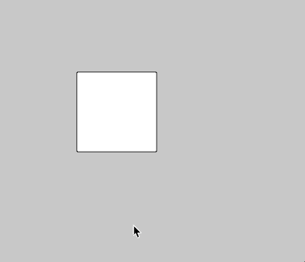
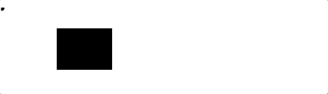

# Click Events

## Tasks
1. **WARM UP**: A rectangle has been drawn. Get the rectangle to change color when the mouse is over it.

2. **CHALLENGE 1**: Uncomment the line of code with `mouseIsPressed`. What prints when you press the mouse? Use `mouseIsPressed` to change the background color when the mouse is clicked.

3. **Challenge 2**: Create code to draw a continuous line of circles on the screen. When the mouse is clicked, change the color to a random value color. 

**STRETCH**: Get the fill to turn a specific color when the mouse is clicked based on the location of the mouse on the screen.

4. **CHALLENGE 3**: When the mouse is clicks a rectangle, change the color to a random color. **STRETCH**: Create 3 rectangles. Each one turns the line a different specific color (e.g. one turns it blue, one red, one green)

5. **CHALLENGE 4**: When the mouse is over a circle, change the color to a random color **STRETCH**: Create 3 circles. Each one turns the line a different specific color (e.g. one turns it blue, one red, one green)

